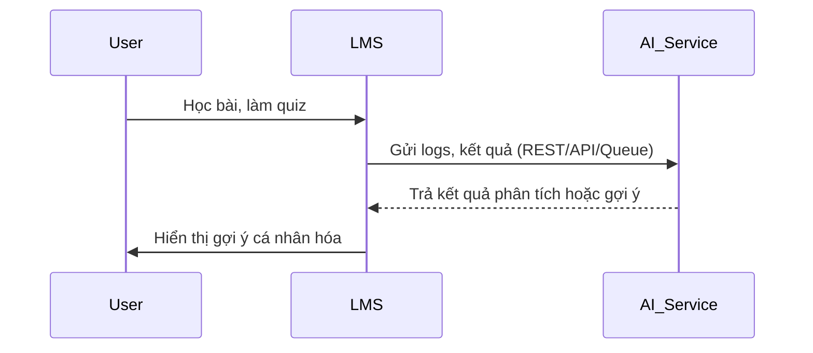

| Mục tiêu chính             | Ý nghĩa                    |
| -------------------------- | -------------------------- |
| Gợi ý nội dung học phù hợp | Tăng hiệu quả học          |
| Điều chỉnh độ khó câu hỏi  | Giúp học đúng mức năng lực |
| Tư vấn lộ trình học        | Tối ưu thời gian học       |
| Gợi ý ôn tập phù hợp       | Củng cố điểm yếu cá nhân   |
| Động viên đúng lúc         | Giảm bỏ học, tăng gắn bó   |

## Giả định:
- Học sinh vừa hoàn thành bài tập
- AI phân tích: điểm kém do kiến thức nào đó
- Đề xuất ôn tập lại bài học đó

LMS gửi thông tin học tập (logs, điểm, bài nộp, hành vi) sang AI → AI xử lý → LMS chủ động lấy kết quả hoặc được AI callback kết quả.

## 1. REST API
Giao tiếp đồng bộ – LMS gọi trực tiếp AI và chờ phản hồi ngay.

### Khi nào dùng?
- Gợi ý học tập ngay sau hành động học (real-time)
- Truy vấn điểm mạnh/yếu khi người dùng mở trang dashboard cá nhân
- Lấy gợi ý bài học tiếp theo khi làm xong một bài kiểm tra

## 2. Event-driven (Kafka / RabbitMQ)
Giao tiếp bất đồng bộ – LMS gửi event (log, quiz result…) vào message queue, AI service sẽ xử lý sau.

### Khi nào dùng?
- Gửi log học tập định kỳ hoặc liên tục
- Đẩy kết quả quiz / bài học để AI cập nhật trạng thái
- Batch training hoặc recommendation không cần ngay lập tức

## 3. Webhook
LMS gửi yêu cầu cho AI → AI xử lý xong rồi gọi ngược lại LMS để báo kết quả.

### Khi nào dùng?
- Xử lý mất thời gian: chấm bài luận, tổng hợp năng lực học viên
- Khi LMS không chủ động polling được
- Khi AI cần báo kết quả ngược lại tự động

| Tiêu chí             | REST API        | Event-driven (Kafka)  | Webhook                   |
| -------------------- | --------------- | --------------------- | ------------------------- |
| Loại giao tiếp       | Đồng bộ         | Bất đồng bộ           | Bất đồng bộ ngược         |
| Phù hợp với use-case | Gợi ý real-time | Log hành vi, điểm số  | Phân tích dài, chấm bài   |
| Tốc độ phản hồi      | Nhanh (ms)      | Trung bình (s → phút) | Trung bình (s → phút)     |
| Phức tạp triển khai  | Thấp            | Trung bình            | Trung bình đến cao        |
| Triển khai bảo mật   | Dễ (JWT)        | Dễ                    | Phức tạp hơn (token, IP)  |
| Retry khi lỗi        | LMS tự retry    | Broker retry (Kafka)  | AI phải retry nếu LMS lỗi |

## Thực tế nên phối hợp cả 3

| Thành phần                  | Công nghệ dùng                   |
| --------------------------- | -------------------------------- |
| Lấy gợi ý khi mở dashboard  | `GET /recommend` (REST)          |
| Gửi quiz result             | Gửi event qua Kafka/RabbitMQ     |
| Phân tích bài luận          | `POST` → rồi AI callback webhook |
| Đẩy log hành vi học         | Event queue (Kafka)              |
| Gợi ý định kỳ (batch daily) | Cron + webhook / REST push       |
