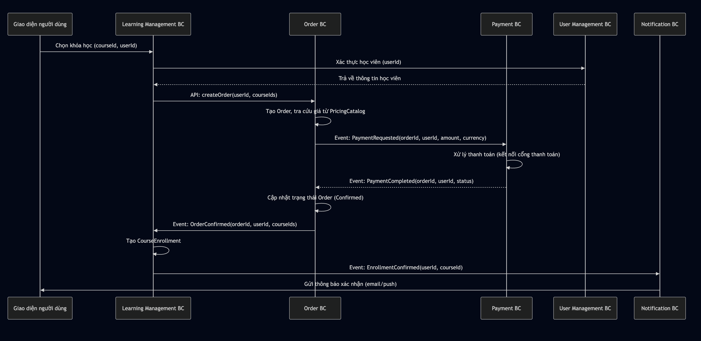
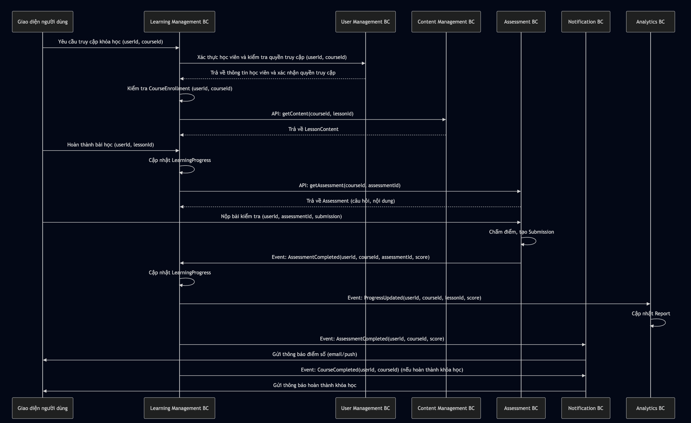

Thiết kế DDD cho Hệ thống E-Learning Tiếng Anh
Tài liệu này mô tả việc áp dụng Domain-Driven Design (DDD) vào hệ thống e-learning tập trung vào học tiếng Anh. Nó bao gồm các sub-domain, bounded context, entity, aggregate, value object, và cách các bounded context tương tác với nhau.
1. Phân tích Sub-domain
Sub-domain là các phần riêng biệt của domain e-learning tiếng Anh, đại diện cho các khía cạnh khác nhau của hệ thống. Dựa trên đặc điểm của hệ thống, các sub-domain bao gồm:

Core Domain: 

Quản lý học tập (Learning Management): Trung tâm của hệ thống, tập trung vào cung cấp nội dung học tập, quản lý tiến trình học tập, và tương tác giữa học viên và giáo viên.


Supporting Sub-domains:

Quản lý đơn hàng (Order Management): Quản lý đơn hàng, giá cả, giảm giá, và điều phối thanh toán.
Quản lý người dùng (User Management): Quản lý tài khoản học viên, giáo viên, và quản trị viên.
Quản lý nội dung (Content Management): Tạo, lưu trữ, và phân phối bài học, bài tập, tài liệu học tiếng Anh.
Hệ thống đánh giá (Assessment): Đánh giá kỹ năng tiếng Anh qua bài kiểm tra, bài tập, hoặc bài thi.
Hệ thống thanh toán (Payment): Quản lý giao dịch tài chính, như thanh toán khóa học hoặc gói học.
Hệ thống giao tiếp (Communication): Hỗ trợ tương tác qua chat, diễn đàn, hoặc lớp học trực tuyến.


Generic Sub-domains:

Hệ thống thông báo (Notification): Gửi thông báo qua email, SMS, hoặc push notification.
Hệ thống phân tích (Analytics): Theo dõi tiến độ học tập, hiệu suất, và tạo báo cáo thống kê.


2. Xác định Bounded Context
Mỗi sub-domain ánh xạ đến một hoặc nhiều bounded context (BC), là các ranh giới logic nơi các khái niệm domain được định nghĩa rõ ràng và nhất quán. Các bounded context bao gồm:

Learning Management BC: Quản lý tiến trình học tập, lịch học, khóa học, bài học, và phân phối nội dung học tập. Thuộc Core Domain.
Order BC: Quản lý đơn hàng, giá cả, giảm giá, và điều phối thanh toán.
User Management BC: Quản lý thông tin người dùng, xác thực, phân quyền.
Content Management BC: Tạo, chỉnh sửa, lưu trữ, và cung cấp nội dung học tập.
Assessment BC: Tạo và chấm điểm bài kiểm tra, bài thi, hoặc bài tập.
Payment BC: Xử lý thanh toán, quản lý gói học, và hóa đơn.
Communication BC: Hỗ trợ giao tiếp qua chat, diễn đàn, hoặc lớp học trực tuyến.
Notification BC: Gửi thông báo đến người dùng.
Analytics BC: Thu thập và phân tích dữ liệu học tập, tạo báo cáo.

3. Xác định Entity, Aggregate, và Value Object
Learning Management BC

Entity:
Course: Khóa học (ID, tên, mô tả, cấp độ, danh sách AssessmentId).
Lesson: Bài học trong khóa học (ID, tiêu đề, nội dung).
LearningProgress: Tiến trình học tập của học viên (ID, học viên, khóa học, trạng thái hoàn thành).
CourseEnrollment: Đăng ký khóa học của học viên (ID, học viên, khóa học, trạng thái đăng ký).


Aggregate:
Course Aggregate: 
Root: Course.
Bao gồm: Các Lesson, danh sách AssessmentId (tham chiếu đến bài kiểm tra trong Assessment BC).


Analytics BC: Thu thập và phân tích dữ liệu học tập, tạo báo cáo.


Value Object:
Level: Cấp độ tiếng Anh (Beginner, Intermediate, Advanced).
LessonContent: Nội dung bài học (text, video URL, tài liệu).
AssessmentId: ID của bài kiểm tra.


Order BC

Entity:
Order: Đơn hàng (ID, học viên, danh sách khóa học, tổng giá, trạng thái: Pending, Confirmed, Cancelled).
OrderItem: Mục trong đơn hàng (ID, khóa học, giá, giảm giá).
PricingCatalog: Danh mục giá (ID, khóa học, giá cơ bản, thời gian hiệu lực).


Aggregate:
Order Aggregate: 
Root: Order.
Bao gồm: Danh sách OrderItem, tổng giá, trạng thái.


PricingCatalog Aggregate: 
Root: PricingCatalog.
Bao gồm: Giá cơ bản của các khóa học.


Value Object:
Price: Giá (số tiền, loại tiền tệ, ví dụ: 500.000 VND).
Discount: Giảm giá (tỷ lệ hoặc số tiền, ví dụ: 10% hoặc 100.000 VND).
OrderSummary: Tổng kết đơn hàng (tổng giá, tổng giảm giá, giá cuối cùng).
PaymentRequest: Yêu cầu thanh toán (chứa orderId, userId, amount, currency).


User Management BC

Entity:
User: Người dùng (ID, tên, email, vai trò: học viên/giáo viên/quản trị viên).
Profile: Hồ sơ cá nhân (ID, thông tin cá nhân, lịch sử học tập).


Aggregate:
User Aggregate: 
Root: User.
Bao gồm: Profile.


Value Object:
Role: Vai trò của người dùng.
Credentials: Thông tin đăng nhập (email, mật khẩu).


Content Management BC

Entity:
ContentItem: Mục nội dung (ID, tiêu đề, loại: video/bài tập/tài liệu).


Aggregate:
ContentItem Aggregate: 
Root: ContentItem.
Bao gồm: Metadata của nội dung.


Value Object:
ContentMetadata: Thông tin bổ sung (định dạng, kích thước, ngày tạo).


Assessment BC

Entity:
Assessment: Bài kiểm tra hoặc bài tập (ID, tiêu đề, loại: trắc nghiệm/tự luận, khóa học liên quan).
Submission: Bài làm của học viên (ID, học viên, điểm số).


Aggregate:
Assessment Aggregate: 
Root: Assessment.
Bao gồm: Danh sách câu hỏi và Submission.


Value Object:
Question: Câu hỏi trong bài kiểm tra (nội dung, đáp án đúng).
Score: Điểm số của bài làm.


Payment BC

Entity:
Payment: Giao dịch thanh toán (ID, số tiền, trạng thái, orderId).
Subscription: Gói học của học viên (ID, loại gói, thời hạn).


Aggregate:
Payment Aggregate: 
Root: Payment.
Bao gồm: Liên kết với Subscription, OrderId.


Value Object:
Money: Số tiền và đơn vị tiền tệ.
SubscriptionPlan: Thông tin gói học (giá, thời gian).
PaymentRequest: Yêu cầu thanh toán (nhận từ Order BC).


Communication BC

Entity:
Message: Tin nhắn (ID, người gửi, người nhận, nội dung).
Conversation: Cuộc trò chuyện (ID, danh sách tin nhắn).


Aggregate:
Conversation Aggregate: 
Root: Conversation.
Bao gồm: Danh sách Message.


Value Object:
MessageContent: Nội dung tin nhắn (text, media).


Notification BC

Entity:
Notification: Thông báo (ID, người nhận, nội dung, trạng thái).


Aggregate:
Notification Aggregate: 
Root: Notification.


Value Object:
NotificationContent: Nội dung thông báo.


Analytics BC

Entity:
Report: Báo cáo hiệu suất học tập (ID, học viên, dữ liệu thống kê).


Aggregate:
Report Aggregate: 
Root: Report.


Value Object:
AnalyticsData: Dữ liệu phân tích (số liệu, biểu đồ).


4. Tương tác giữa các Bounded Context
Context Mapping

Learning Management BC và Order BC:
Map: Customer-Supplier.
Learning Management BC (Customer): Gửi thông tin khóa học (courseId) đến Order BC khi học viên chọn khóa học.
Order BC (Supplier): Tạo đơn hàng, tính giá, áp dụng giảm giá, trả về trạng thái đơn hàng.


Order BC và Payment BC:
Map: Customer-Supplier.
Order BC (Customer): Gửi yêu cầu thanh toán (PaymentRequest) đến Payment BC.
Payment BC (Supplier): Xử lý giao dịch, trả về sự kiện PaymentCompleted.
Shared Kernel: Money và PaymentRequest để đảm bảo định dạng giá nhất quán.


Learning Management BC và User Management BC:
Map: Customer-Supplier.
Learning Management BC cần thông tin người dùng để gán học viên/giáo viên vào khóa học.


Learning Management BC và Content Management BC:
Map: Shared Kernel hoặc Customer-Supplier.
Learning Management BC lấy nội dung từ Content Management BC để phân phối bài học.


Learning Management BC và Assessment BC:
Map: Customer-Supplier.
Assessment BC cung cấp điểm số và kết quả để cập nhật tiến trình học tập.


Notification BC và các BC khác:
Map: Publish-Subscribe.
Notification BC nhận sự kiện từ các BC để gửi thông báo.


Analytics BC và Learning Management BC:
Map: Customer-Supplier.
Analytics BC thu thập dữ liệu từ Learning Management BC để tạo báo cáo.


Communication BC và User Management BC:
Map: Customer-Supplier.
Communication BC cần thông tin người dùng để quản lý tin nhắn.


Integration Patterns

Domain Events:
OrderCreated (từ Order BC): Chứa orderId, userId, danh sách courseId, tổng giá. Được gửi khi đơn hàng được tạo.
PaymentRequested (từ Order BC): Chứa orderId, userId, amount, currency. Gửi yêu cầu thanh toán đến Payment BC.
PaymentCompleted (từ Payment BC): Chứa orderId, userId, status. Thông báo thanh toán hoàn tất.
OrderConfirmed (từ Order BC): Chứa orderId, userId, danh sách courseId. Thông báo cho Learning Management BC để tạo CourseEnrollment.
AssessmentCompleted (từ Assessment BC): Chứa điểm số, userId, courseId. Cập nhật LearningProgress.
CourseCompleted (từ Learning Management BC): Thông báo hoàn thành khóa học.


APIs:
Order BC: createOrder(userId, courseIds) để Learning Management BC yêu cầu tạo đơn hàng.
Payment BC: createPaymentRequest(orderId, userId, amount, currency) để Order BC gửi yêu cầu thanh toán.
User Management BC: Cung cấp API xác thực và thông tin người dùng.
Content Management BC: Cung cấp API truy xuất nội dung.
Assessment BC: Cung cấp API truy xuất bài kiểm tra.


Message Queues: Sử dụng RabbitMQ, Kafka để xử lý sự kiện bất đồng bộ.

Ví dụ luồng tương tác

Học viên đăng ký khóa học:
User Management BC: Xác thực học viên.
Learning Management BC: Gửi courseId đến Order BC qua API createOrder(userId, courseIds).
Order BC: Tạo Order, tra cứu giá từ PricingCatalog, áp dụng giảm giá, gửi PaymentRequested đến Payment BC.
Payment BC: Xử lý thanh toán, phát sự kiện PaymentCompleted.
Order BC: Cập nhật trạng thái Order (Confirmed), phát sự kiện OrderConfirmed.
Learning Management BC: Nhận sự kiện, tạo CourseEnrollment.
Notification BC: Gửi thông báo xác nhận.


Học viên hoàn thành bài kiểm tra:
Assessment BC: Chấm điểm, lưu Submission, phát sự kiện AssessmentCompleted.
Learning Management BC: Cập nhật LearningProgress.
Analytics BC: Thu thập dữ liệu để tạo báo cáo.
Notification BC: Gửi thông báo điểm số.


Học viên giao tiếp với giáo viên:
Communication BC: Tạo Conversation, lưu Message.
User Management BC: Cung cấp thông tin người dùng.
Notification BC: Gửi thông báo tin nhắn mới.


5. Cập nhật chi tiết từ thảo luận
Dựa trên các câu hỏi, dưới đây là các cập nhật liên quan đến Order BC, Payment, Course, và giá cả:
Hệ thống Order riêng

Lý do: 
Tách biệt trách nhiệm: Learning Management BC tập trung vào học tập, Order BC quản lý đơn hàng và giá cả, Payment BC xử lý giao dịch.
Dễ mở rộng: Order BC hỗ trợ giảm giá, combo khóa học, giá động.
Dễ thay đổi giá: Giá được quản lý trong PricingCatalog, không ảnh hưởng đến Course Aggregate.


Thiết kế:
Thêm Order BC với Order Aggregate và PricingCatalog Aggregate.
Order BC nhận courseId từ Learning Management BC, tra cứu giá, tạo đơn hàng, và gửi yêu cầu thanh toán đến Payment BC.


Giá khóa học

Không để giá trong Learning Management BC:
Lý do: Giá trong Course Aggregate làm phức tạp logic, khó mở rộng (giá động, giảm giá), và vi phạm Single Responsibility.
Giải pháp: Chuyển giá sang Order BC, lưu trong PricingCatalog. Course chỉ chứa thông tin học tập (ID, tên, mô tả).


Cách định giá:
Order BC tra cứu giá từ PricingCatalog (dựa trên courseId) hoặc áp dụng logic giảm giá (mã khuyến mãi, combo).
Giá có thể thay đổi theo thời gian, khu vực, hoặc chương trình khuyến mãi mà không ảnh hưởng đến Learning Management BC.


Mối liên hệ giữa Payment, Order, và Learning Management

Learning Management BC khởi tạo quy trình bằng cách gửi courseId đến Order BC.
Order BC tạo đơn hàng, tính giá, gửi PaymentRequested đến Payment BC.
Payment BC xử lý giao dịch, trả về PaymentCompleted.
Order BC xác nhận đơn hàng, gửi OrderConfirmed đến Learning Management BC để tạo CourseEnrollment.

Số lượng Aggregate Root trong Learning Management BC

Xác nhận: 3 Aggregate Root:
Course Aggregate: Quản lý cấu trúc khóa học.
LearningProgress Aggregate: Theo dõi tiến trình học tập.
CourseEnrollment Aggregate: Quản lý quyền truy cập khóa học.


6. Một số lưu ý khi triển khai

Tách biệt Bounded Context: Mỗi BC nên có cơ sở dữ liệu riêng để tránh phụ thuộc chặt chẽ.
Sử dụng Domain Events: Giảm phụ thuộc trực tiếp, tăng linh hoạt.
Tập trung vào Core Domain: Learning Management BC là trung tâm, ưu tiên tối ưu hóa.
Quản lý giá trong Order BC: 
PricingCatalog hỗ trợ giá động, lịch sử giá, và giảm giá.
Dễ dàng mở rộng cho các kịch bản như giá theo khu vực, combo khóa học.


Công cụ hỗ trợ: Sử dụng Event Sourcing, CQRS, hoặc hàng đợi tin nhắn (RabbitMQ, Kafka) nếu hệ thống phức tạp.

7. Flow

Luồng mua hàng
```mermaind
sequenceDiagram
    participant UI as Giao diện người dùng
    participant LM as Learning Management BC
    participant OM as Order BC
    participant PM as Payment BC
    participant UM as User Management BC
    participant NM as Notification BC

    UI->>LM: Chọn khóa học (courseId, userId)
    LM->>UM: Xác thực học viên (userId)
    UM-->>LM: Trả về thông tin học viên
    LM->>OM: API: createOrder(userId, courseIds)
    OM->>OM: Tạo Order, tra cứu giá từ PricingCatalog
    OM->>PM: Event: PaymentRequested(orderId, userId, amount, currency)
    PM->>PM: Xử lý thanh toán (kết nối cổng thanh toán)
    PM-->>OM: Event: PaymentCompleted(orderId, userId, status)
    OM->>OM: Cập nhật trạng thái Order (Confirmed)
    OM->>LM: Event: OrderConfirmed(orderId, userId, courseIds)
    LM->>LM: Tạo CourseEnrollment
    LM->>NM: Event: EnrollmentConfirmed(userId, courseId)
    NM->>UI: Gửi thông báo xác nhận (email/push)
```



Luồng học tập
```
sequenceDiagram
    participant UI as Giao diện người dùng
    participant LM as Learning Management BC
    participant UM as User Management BC
    participant CM as Content Management BC
    participant AM as Assessment BC
    participant NM as Notification BC
    participant AN as Analytics BC

    UI->>LM: Yêu cầu truy cập khóa học (userId, courseId)
    LM->>UM: Xác thực học viên và kiểm tra quyền truy cập (userId, courseId)
    UM-->>LM: Trả về thông tin học viên và xác nhận quyền truy cập
    LM->>LM: Kiểm tra CourseEnrollment (userId, courseId)
    LM->>CM: API: getContent(courseId, lessonId)
    CM-->>LM: Trả về LessonContent
    UI->>LM: Hoàn thành bài học (userId, lessonId)
    LM->>LM: Cập nhật LearningProgress
    LM->>AM: API: getAssessment(courseId, assessmentId)
    AM-->>LM: Trả về Assessment (câu hỏi, nội dung)
    UI->>AM: Nộp bài kiểm tra (userId, assessmentId, submission)
    AM->>AM: Chấm điểm, tạo Submission
    AM->>LM: Event: AssessmentCompleted(userId, courseId, assessmentId, score)
    LM->>LM: Cập nhật LearningProgress
    LM->>AN: Event: ProgressUpdated(userId, courseId, lessonId, score)
    AN->>AN: Cập nhật Report
    LM->>NM: Event: AssessmentCompleted(userId, courseId, score)
    NM->>UI: Gửi thông báo điểm số (email/push)
    LM->>NM: Event: CourseCompleted(userId, courseId) (nếu hoàn thành khóa học)
    NM->>UI: Gửi thông báo hoàn thành khóa học
```
